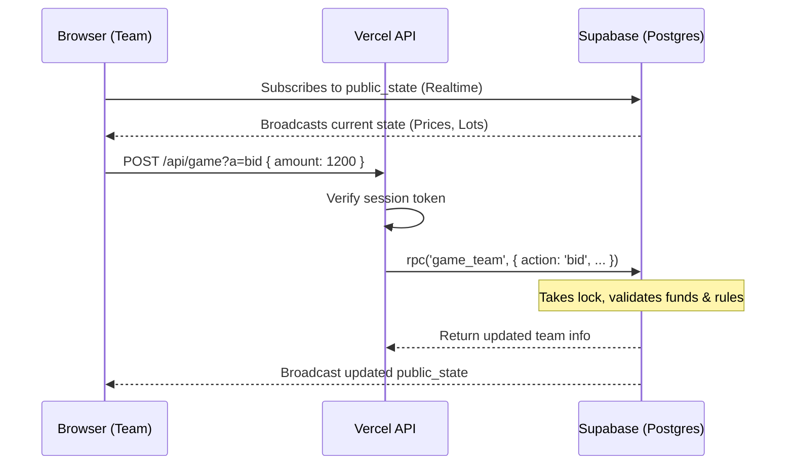
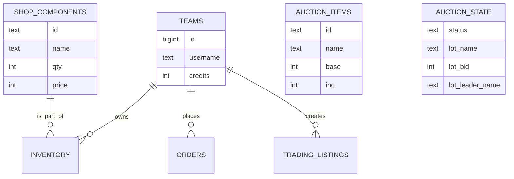

<div align="center">
  <h1>All-in Put 🎲</h1>
  <p><strong>A Real-Time Auction & Trading Game Platform for Electronic Components</strong></p>
</div>

---

**All-in Put** is a fast-paced team-based game where players buy and bid on electronic components (Arduinos, sensors, etc.). Built with React, Vite, and Vercel serverless functions, it heavily leverages **Supabase Postgres** for secure, real-time game state synchronization and transactions.

## 🚀 Features

- **Live Auctions & Bidding**: Real-time bidding system with anti-snipe extensions and lot queuing.
- **Component Shop**: Teams can buy fixed-price components with varying quantities.
- **Team-to-Team Trading**: A player-driven marketplace to trade components.
- **Admin Dashboard**: Full control over timers, lots, component prices, and team management.
- **Bulletproof Concurrency**: Postgres row-level locks prevent race conditions when multiple teams bid simultaneously.

## 🏗 Architecture

The game is designed with a **Thin API, Thick Database** philosophy.
- **Browser**: Reads a public snapshot directly from Supabase Realtime.
- **API**: Validates team sessions and passes instructions to database RPCs.
- **PostgreSQL**: Contains *all* game logic (auctions, validations, bidding, inventory).



## 🛠️ Tech Stack

| Frontend | Backend | Database | Deployment |
| --- | --- | --- | --- |
| React 19 | Node.js Serverless | PostgreSQL (Supabase) | Vercel |
| Vite 6 | crypto (HMAC tokens)| Row-Level Security | Supabase Hosting |

## 📦 Database Entity Relationship



## 🚀 Getting Started

### 1. One-time database setup

1. Go to **Supabase Dashboard** → **SQL Editor**.
2. Paste the contents of `supabase/schema.sql`.
3. **Run** the script. This creates tables, locks them down, and seeds components.

### 2. Environment Variables

Create a `client/.env` file:

| Variable | Where | Notes |
| --- | --- | --- |
| `SUPABASE_URL` | server + build | Your Supabase project URL |
| `SUPABASE_PUBLISHABLE_KEY` | build | Read-only access to `public_state` for browsers |
| `SUPABASE_SECRET_KEY` | server only | Never expose to the browser |
| `SESSION_SECRET` | server only | Long random string (changing it logs out everyone) |
| `ADMIN_PASS` | server only | Admin login uses username `admin` + this password |

### 3. Run Locally

```bash
npm install
npm run dev
```

`npm run dev` serves the Vite app and also mounts the Vercel API locally.

### 4. Deploy to Vercel

1. Import the repository in Vercel.
2. Set **Root Directory** to `all-in-put/aio/client`.
3. Framework Preset: **Vite**.
4. Add the 5 Environment Variables.
5. Deploy!

## 🎮 Routes

- `/#/` — Team login and dashboard
- `/#/admin-login` — Administrator panel
- `/#/display` — Public Shop Board
- `/#/auction-display` — Public Auction Board
